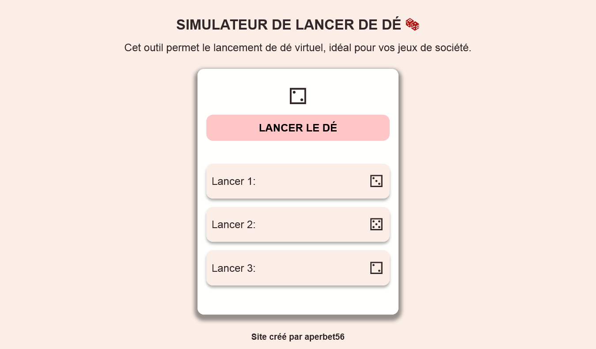

## SIMULATEUR DE LANCER DE DÉ (DICE ROLL SIMULATOR) 🎲

## Le challenge

Construction d'un simulateur de lancer de dé en HTML5, CSS3 et JavaScript avec la présence d'un historique des résultats des lancers précédents.

## Démonstration

Lien vers le projet : https://aperbet56.github.io/simulateur_de_lancer_de_de/

## Développez avec

- Utilisation des balises sémantiques HTML5
- CSS
- Flexbox
- Animations css
- Page web responsive
- Utilisation d'un normaliseur : le fichier normalize.css
- JavaScript
- Code JavaScript commenté
- Desktop first
